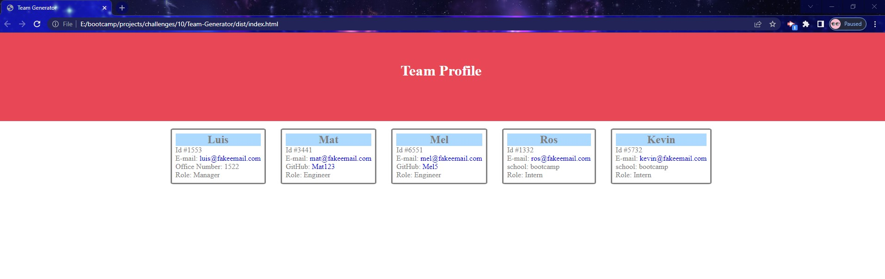
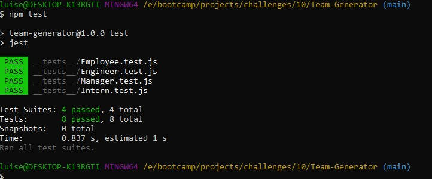

# Team Profile Generator

## ToC
- [Description](#description)
- [Features](#features)
- [Usage](#usage)
- [Preview](#preview)

## Description
Program that let users create a custom html file base on command line prompts to populate html file into a good looking Team Profile webpage.

## Features 
- Node: To get dependency packages and run the app.
- Jest: To test different classes.
- Inquirer: To prompt user in command line.
- Fs: to access file system and write into html file.

## Usage
Open command line and enter 'npm run', then just answer a few question and when you EXIT THE PROGRAM your newly custom html file should be in dist/index.html

### Run Jest
Open command line and enter 'npm test' or 'npm test {class name}' to test different classes.

## Preview

[Video preview](https://drive.google.com/file/d/1FNHJuSgb-kmT0bl1e27KCx89wnb5Xa6m/view)
### Page Preview

### Test Response

